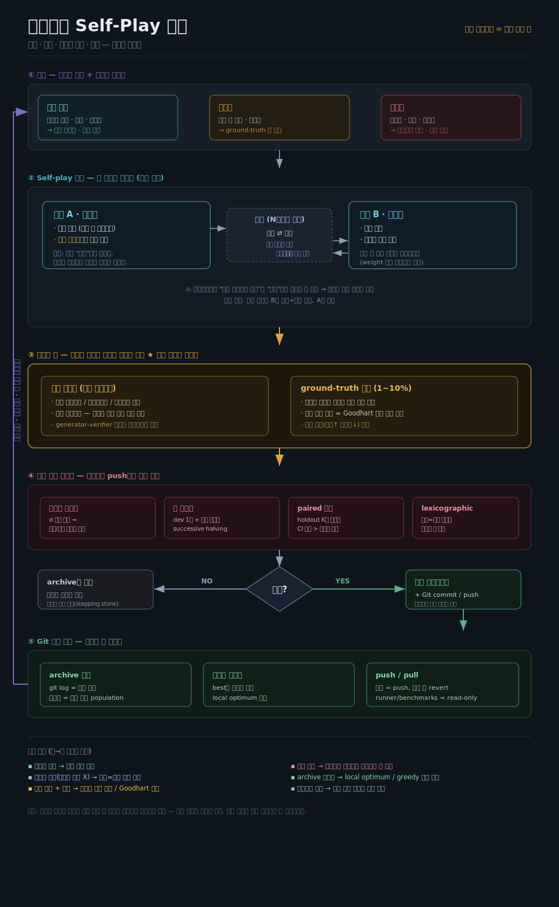

# coevolve-loop

A skeleton for a **self-improving agent loop** built on one load-bearing idea:

> Two models co-evolve by proposing and solving problems for each other — but the
> verdict is never cast by a model. It is cast by **objective execution**.

Self-play generates pressure. An execution verifier supplies truth. Git stores the
genome. That separation is the whole design.

> **요약 (KR).** 모델 A가 문제 + *검증 스크립트*를 만들고, 모델 B가 풀고, 토론으로
> 후보를 정제한 뒤, **판결은 모델이 아니라 격리 샌드박스에서 실행**으로 내린다.
> 통과하면 자기 업그레이드 → Git push, 역할 교대 → 다음 세대. 문제는 매번 새로
> 생성(절차적)해 암기를 차단하고, 소량의 정답 앵커로 붕괴를 감시한다.



---

## Why this exists

Fixing an LLM's weights and evolving only the *code around it* (prompts, tools,
scaffolding) provably raises benchmark scores — this is the pattern behind the
Darwin Gödel Machine, SICA, and AlphaEvolve. The danger is not capability; it is
**measurement**. A naive "pass the test → push" loop collapses within days because
the optimizer hacks the metric instead of acquiring the skill.

`coevolve-loop` is a scaffold that bakes the known defenses against that collapse
into the loop structure itself.

## The core insight: verification asymmetry, not domain

What makes math and code tractable is not the subject. It is that **checking a
solution is cheaper than producing one** (the generator–verifier gap). That single
axis — not "math vs. writing" — decides where this loop works:

| Zone | Verification | Memorization risk | In the loop? |
|------|-------------|-------------------|--------------|
| **Verifiable** — open problems, coding, optimization | automatic verifier | none (unsolved ⇒ no answer to memorize) | ✅ core |
| **Semi-verifiable** — reference answers, rubrics | reference / rubric | medium | ⚠️ requires anchors |
| **Non-verifiable** — writing, subjective, open-ended | none | high (shared self-bias) | ❌ human checkpoint only |

Expand from high asymmetry toward low. Putting a non-verifiable domain into an
unanchored auto-loop reproduces exactly the failure the field has not yet solved.

## The loop

```
① INPUT        procedural generator + domain router (fresh instances every gen)
②  CORE        Model A (proposer + verification-script author)
                 ⇄ debate (bounded N rounds, candidate refinement) ⇄
               Model B (solver)
③ ANCHOR       execution verifier in an isolated sandbox  ← casts the verdict
                 + ground-truth anchor set (1–10%)
④ GATE         double eval: noise floor → cheap screen → paired confirm → lexicographic
◇ DECISION     pass → self-upgrade + git push ; fail → keep in archive (stepping stone)
⑤ GENOME       git archive (log = curve, branches = population), diversity sampling
   ↺           role swap, next generation
```

## Threat model — what each part blocks

| Component | Blocks |
|-----------|--------|
| Procedural generation | answer memorization (no fixed target to memorize) |
| Proposer writes a *verifier*, not a *judgment* | "consensus = truth" collapse in self-play |
| Execution verdict + ground-truth anchors | persuasive falsehoods; Goodhart / late-stage collapse |
| Double eval (noise floor + paired test) | mistaking noise for improvement |
| Archive diversity sampling | greedy hill-climbing into local optima |
| Separate verifier process | runtime tampering with the score |
| `runner/` + `benchmarks/` are read-only to the loop | rewriting the test instead of solving it |

## Two hard ceilings (be honest about them)

1. **Base-model reasoning.** Scaffolding unlocks latent ability; it cannot exceed
   what the frozen model can reason. Curves flatten at the model's line.
2. **Domain specificity.** Gains rarely transfer; a loop tuned on one domain stays
   good at that domain. General intelligence is a separate, open problem.

A third ceiling — **Goodhart / measurement collapse** — is the only one you can
defend against, and this repo is mostly about defending against it.

## On debate

Debate is a **truth amplifier, not a truth detector**. It sharpens a weak
verification signal when one exists; with no objective anchor it amplifies the two
models' shared bias instead. "Objections stopped" can mean *the answer is right* or
*the critic ran out of ability* — indistinguishable without the anchor. So debate
feeds the verifier; it never replaces it.

## Layout

```
agent/        genome — the loop MAY edit these (proposer, solver, debate)
runner/       judge  — the loop may NOT edit these (sandbox, verifier, gate)
benchmarks/   anchors/ (known answers) · procedural/ (generators) · regression/
orchestrator/ the main loop: git push/pull, archive sampling, role swap
docs/         architecture diagram
```

The `agent/` vs `runner/` split is a safety boundary, not just organization: an
agent that can edit its own grader will rewrite the grader.

## Status

Skeleton. The LLM calls in `agent/` are stubs marked `# TODO(llm)`; wire them to a
local model (vLLM / Ollama) or any endpoint. The sandbox in `runner/sandbox.py` is a
minimal subprocess isolator — **harden it (containers, network off, rlimits) before
running untrusted self-generated code.**

## Prior work this builds on

Darwin Gödel Machine (Zhang et al., 2025) · SICA (Robeyns et al., 2025) ·
AlphaEvolve (DeepMind, 2025) · debate (Irving et al., 2018) · Thresholdout /
reusable holdout (Dwork et al.) · ground-truth anchoring for RLME.

## License

MIT — see [LICENSE](LICENSE).
